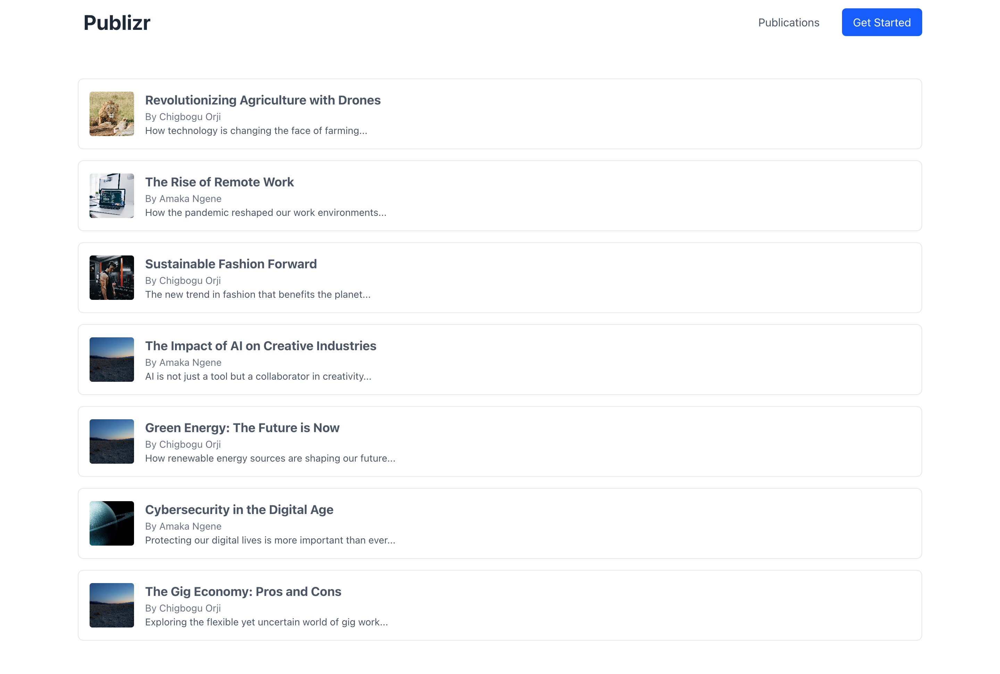

# Publizr UI
A publication platform

## Home page
Upon visiting the site, this is the homepage.
#### Click on any of the `get started` buttons to go to the signup page.
#### Click on `publications` link to visit the publications on the platform.
[src/views/home-page.tsx](src/views/home-page.tsx)

## Login screen
Allows you to login to the platform, though the platform can be accessed without logging in, but having an account is required for authors who wish to publish their own articles.

#### Provide your email address and password to login to the platform.
[src/views/login-screen.tsx](src/views/login-screen.tsx)

## Create account screen
[src/views/signup-screen.tsx](src/views/signup-screen.tsx)
To be able to publish a new post, you must be a registered user, this screen provides registration information
On the screen.
#### provide your `username`, `email`, `password`, and `confirm password` details to sign up.
#### `Craete Account` button is disabled until all details are provided

#### Failed password strength check

#### Passed password strength check

#### Password and confirm password not matching

#### First-time login, no post yet

### Create new post screen
[src/views/dashboard/index.tsx](src/views/dashboard/index.tsx)
This screen provides a way to create a new post

## Authors posts page
[src/views/posts/post-listing.tsx](src/views/posts/post-listing.tsx)
When an author makes a post, this screen is where the author can see all the post he has made, both `published` and `draft` posts.

## Logged in user's basic information
A thumbnail for loggedin users, showing their profile avatar, username, and a logout button

## Recent post screen
Here, is a list of the 10-most-recent posts in the platform, ordered by last post date.
It displays a post details, showing the author, date and time of the post, and a link to the post.
This screen only shows the posts authors marked as published.
[src/views/posts/featured-post.tsx](src/views/posts/featured-post.tsx)

## Post screen
Here's a screen that displays the post for reading

[src/views/posts/post-detail.tsx](src/views/posts/post-detail.tsx)

## All posts scrren
[src/views/posts/post-listing.tsx](src/views/posts/post-listing.tsx)
An ordered list of all posts, with each item being linked to a post

